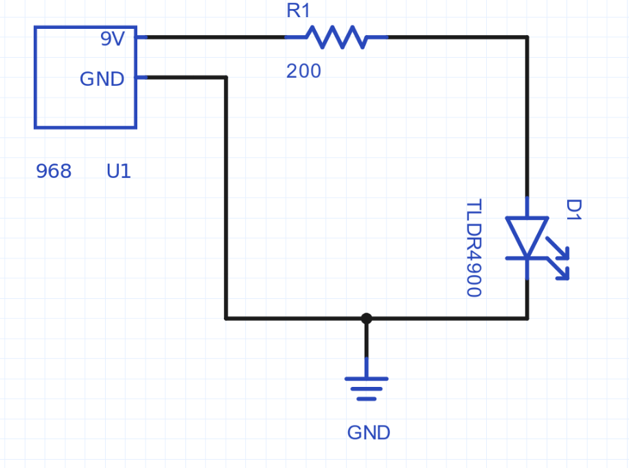
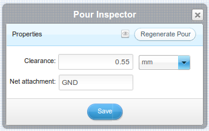

% Getting Started with Upverter

Welcome to Upverter. Here's a guide to get you started with designing schematics
and printed circuit boards (PCBs) in our tool.

## Creating an Account

The first step to working in Upverter is creating an account. To do this, go to
[upverter.com](http://www.upverter.com) and click *Signup* in the top right.
You'll be presented with our pricing options:

### Professional Team
This account type is for businesses looking to use Upverter. It will allow you
to manage a team of users, and handles billing for multiple accounts.

### Awesome Individual
This account type is for individual users who need to work on projects
privately. It will allow you to collaborate on both private and public projects.

### Open-Source Team
This account type is for open source projects that want to collaborate. It
allows for multiple projects, but all these projects will be publicly visible.
You will need to create an account (Awesome or Open Source individual) before
creating an open source team.

### Open-Source Individual
This account type allows you to create and collaborate on projects that are
publicly visible.

You can evaluate the Awesome Individual or Professional Team accounts for one
month. If you have any questions about evaluations or pricing, please contact
us.

Select either Awesome Individual or Open-Source Individual, fill out the sign up
form, and click *Create My Account*. You'll now have the option to watch the
walk through video, and fork your first design. Click *Proceed to Dashboard* in
the top right to continue.

## The Dashboard

Your dashboard is the center of all your activity on Upverter. From here you can 
see:

* Your news feed, showing things you've recently done or actions that have been
  performed on your designs.
* Your projects
* Your Teams
* Projects you're watching
* Your favorite parts
* Parts you've modified
* Your notifications
* Hackers you follow

At the top of the page, there are actions you can take. Lets start a new project 
by clicking *New Project*.

## Creating a Project

This will open the new project dialog. From here, you can name your project, set 
a description, add tags, set a license, and link the project to Github. On the 
other tabs, you can set permissions and write a read me for the project. You can 
always change these settings later, so lets create a simple project:

## The Project Page

Once we create the project, we're taken to the project page. This is where you 
can see all the information on your project. As with the dashboard, the actions 
are shown at the top of the page.

With these actions we can comment on the project, open it up in the editor,
order PCBs and components, and change settings. Lets start up the editor to
start working on our project. Click *Open in Editor*.

## The Schematic Editor

When the schematic editor first starts up, you will get a quick tour. This will 
point out the main parts of the schematic editor. When you're done with it,
click *Get Started*.

### The Toolbar

On the left side of the tool, we have the toolbar. This lets us select tools to
edit our schematic. Most tools also have sub-tools. Lets look at the tools that
are available.

From top to the bottom, the tools are:

* **Select and Move**. This lets you select things and move them around. You can 
  also drag a box in the background to select a group of things.
    * **Rotate Left**, rotate a component left
    * **Rotate Right**, rotate a component right
    * **Flip**, flip a component vertically
    * **Copy**
    * **Paste**
    * **Delete**
    * **Inspect**, show data about the selected item
* **Add component**, click the drop down to search the library for a component
* **Net**, draws nets, which define connections between pins.
* **Connection marker**, which lets you place flags to mark nets. These are 
  useful for replacing long nets, and for replacing common nets such as ground.
* **Annotation**, which lets you place text on your schematic for reference.
* **Pan**, which lets you drag to move around the schematic.
    * You can also click and hold to pan

You can also use the shortcut key for each tool, which is shown when holding
your mouse over the tool. Learning the shortcuts is key to working quickly in
the tool.

### Panels

On the right side of the schematic editor, there's the panels bar. This lets you 
open the various panels. They are:

* **History**, which shows the actions you've done and lets you undo and redo 
  them.
* **Parts**, which lists all the parts in your design
* **Design rules**, which shows violations of design rules, and lets you set 
  which rules are enabled
* **Nets**, which lists all the nets in your design
* **Simulation**, which allows you to run simulations

### Creating a Schematic
Lets create a basic schematic. We'll do this by adding some parts, and
connecting them using nets.

First, lets add a 9 volt battery holder. Click the add component tool on the
left, then click the drop down. Type 'Keystone 968' in the search box and hit 
enter. This will return matching parts. We're looking for the Keystone 968
battery holder. Double click the part, then place it on your schematic.

Next, we'll place a generic resistor. To place this part, click on the add
component tool, and click the drop down. Find the resistor in the list of
generic parts and click it. Place it to the right of the battery.

We need to change the footprint of the resistor. To do this, double click it to
open the inspector.

From the footprint dropdown, select *axial*. We'll also change the resistance 
property from 5k to 200. When you're done, click Save.

The final component we'll add is an LED. Click the add component tool, then the
drop down. Search for 'TLDR4900', which is a generic RED led. Double click the
part to add it, and press 'r' to rotate it. Place the LED to the right and below
the resistor.

Now that we've place our components, lets connect them with nets. Click the net 
tool on the left and click the '9V' pin of the battery holder, then click the 
left pin of the resistor to make a connection.

Continue to use the net tool to make connections as shown:

Finally, we'll add a ground to our circuit. Click the connection marker tool on 
the left, then click GND.

We'll add the ground to our circuit and use the net tool to connect it:

Our schematic is complete! We can check out what parts we're using using the 
parts pane on the right. Note that there's a footprint symbol beside each of our 
parts. This means they have footprints and can be added to a PCB.

## The PCB Editor

### Laying out a PCB

Now that we have a completed schematic, lets lay out a PCB. Switch over to the 
PCB view using the *PCB Editor* button at the top of the page. This will show us 
our PCB.

Lets set our board size first. Double click in the background to open the 
inspector, then set the size to 1.2 inches by 1.2 inches. Click save then close 
the dialog.

This blue outline shows the edge of our PCB. It will be used by the manufacturer 
to cut the board out. Now we'll click and drag the components to place them 
inside the board. We'll also click the components and press 'r' to rotate them.

Now we need to connect our components. Note the red lines between the pads. This 
is called the ratsnest, and it shows where we need to draw traces to connect our 
components together.

To draw a trace, click the trace tool on the left or press 'a'. While drawing a 
trace, press space to switch the trace angle. Place the traces between all of 
the pads that are connected with red lines to complete the circuit.

Now our board is routed, but lets add a pour to fill in the empty spaces. Click
the pour tool on the left, then draw a square around the board. Press 'esc' when
you're done drawing to finish the pour.

Double click on your pour outline to open the pour inspector. 

Set the *net attachment* to 'GND' so our pour connects to ground, then click 
*Regenerate Pour*. Finally, click the eye to make the pour visible.

Now our PCB looks good. But how do we get it made?
